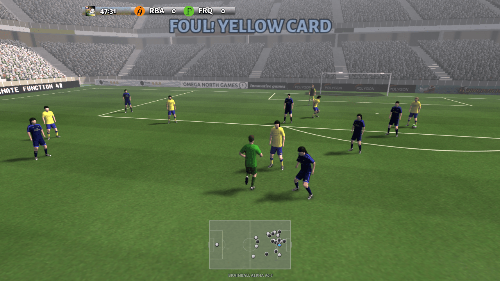
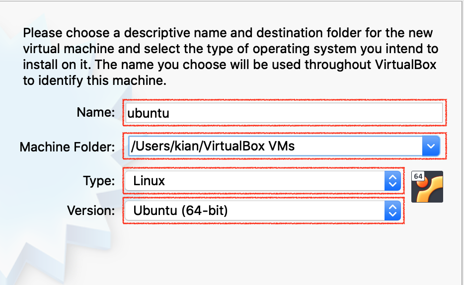
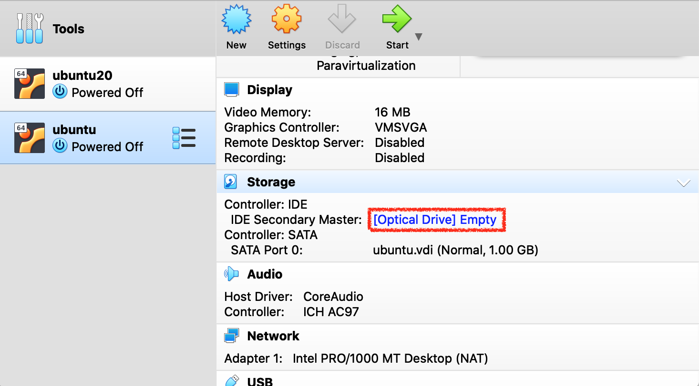
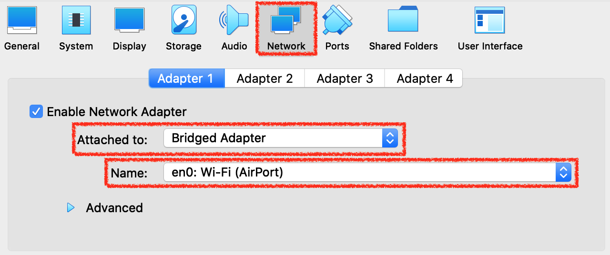
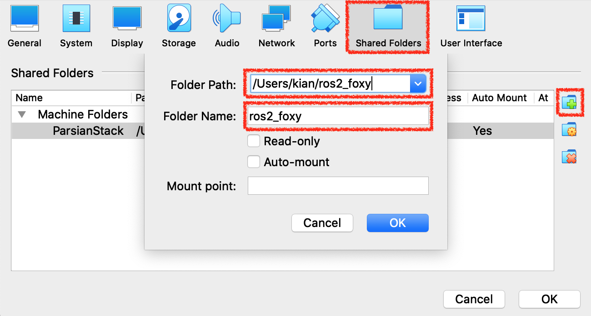

# KaggleFootbal - Playing Soccer Using Kaggle Environment
Implementation of 11VS11 kaggle football environment.

<p align="center">

</p>

## kaggle
The project is based on kaggle environment that was contributed google-research community. It performs a physical simulation of football game with appropriate actions and observations.
You can found it from this [github link](https://github.com/Kaggle/kaggle-environments).

## Installation
This project is based on kaggle environment and it can be run on any Operating Systems with this installed on it. (this project is developed and tested on Ubuntu 20.04)
The best choice to use kaggle environmetn is on ubuntu 20.04,  it can be installed on other operating systems as well but may not be as stable as the ubuntu.
For convenience installing kaggle on oracle virtual machine with ubuntu 20.04 will be explained as well, in case of not having ubuntu.

### Ubuntu 20.04
kaggle supports different Linux distributions, any one of them is fine to work with.
- First you need to install google-research football environment. install required packages using apt:

	```bash
	sudo apt-get install git cmake build-essential libgl1-mesa-dev libsdl2-dev \
	libsdl2-image-dev libsdl2-ttf-dev libsdl2-gfx-dev libboost-all-dev \
	libdirectfb-dev libst-dev mesa-utils xvfb x11vnc libsdl-sge-dev python3-pip
	```

- Then using pip3 install:
	```bash
	python3 -m pip install --upgrade pip setuptools psutil
	```

- After the installation is complete simply install the google football environment:
	```bash
	python3 -m pip install gfootball
	```

- After installing gfootball, you need to install kaggle environment as well:
	```bash
	pip install kaggle-environments
	```
	**or** install it from source using:
	```bash
	git clone https://github.com/Kaggle/kaggle-environments.git
	cd kaggle-environments && pip install .
	```

- Finally you need to install a simple python geometery library, this project uses a library from this [github link](https://github.com/sbliven/geometry-simple)
you can install it from source using:
	```bash
	git clone https://github.com/sbliven/geometry-simple.git
	cd geometry-simple
	sudo python setup.py install
	```
Now you have all the things you need to run this project. just run the `main.py` file with a python3 interpreter.

### MacOS and Windows
Although kaggle supports Windows10 and macOS at this time but  the installation is not as stable as Linux. All in all, you can successfully run the project on these platforms but using a virtual machine like Oracle VM VirtualBox is recommended if you insist on using these Operating Systems.

### Oracle VM VirtualBox
You can download your suitable version of Oracle VM from [this link](https://www.oracle.com/virtualization/technologies/vm/downloads/virtualbox-downloads.html).
Then you need to download an Ubuntu 20.04 Desktop ISO file from the [official page](https://ubuntu.com/download/desktop).
- Now, Start the VirtualBox application and create a new VM.
<p align="center">

</p>

- Then name your VM, specify a path for it, and choose Linux 64 bit as it's type.
<p align="center">

</p>

- Choose the **memory size** you wish the VM has.

- Then, choose **Create a virtual hard disk now** and select create.

- After that, choose **VDI (VirtualBox Disk Image)** and select continue.

- It is better to use **Fixed size** storage type.

- Specify your desired **disk size** and **it's path** afterward.

- Now after your VM created, click your VM from the left bar and right click on **Controller:IDE** section from right menu.
<p align="center">

</p>

- Choose the Ubuntu 20.04 ISO file you have downloaded.
- Click on start, to start your VM and Install Ubuntu 20.04 on it.
- After the installation you can follow the steps for **Ubuntu 20.04** Installation above.

#### Optional - Oracle VM VirtualBox
- **Running project on multiple machines on local network**\
if you intent to distribute your nodes on different hosts across your local network, you need to change your VM's network preferences.
    - Shutdown your VM, select your VM from VirtualBox application, and click on settings on top of the window.
    - Choose the **Network** tab from the top, and change the **NAT** setting to **Bridged Adapter**.
    - Then choose one of your host's network interfaces from the second dropdown menu.
    - Now your router will assign a seperate IP address to your VM, you can check it out by `ifconfig` command.
         ```bash
        sudo apt install net-tools
        ifconfig
        ```
<p align="center">

</p>

- **Define a shared folder between host and VM** (adopted from [here](https://gist.github.com/estorgio/1d679f962e8209f8a9232f7593683265))\
To define a shared folder between your host and VM, first you need to have it on your host and then mount it on the VM.
    - Say we want to mount `/Users/<username>/ros2_foxy` from the host to `/home/<username>/ros2_foxy` on your VM.
    - Shutdown your VM, select your VM from VirtualBox application, and click on settings on top of the window.
    - Choose the **Shared Folders** tab from the top, and click on the **Add new shared folder** icon. (picture at the end of the section)
    - Choose the folder on your host, and put it's name in the second field and leave everything else unchecked. (picture at the end of the section)
    - Run your VM, and run the commands bellow.
        ```
        sudo apt-get update
        sudo apt-get install build-essential linux-headers-`uname -r`
        ```
    - from the top of your VM, go to **Devices** menu -> **Insert Guest Additions CD image menu**, and let the process finishes.
    - reboot your VM.
        ```
        sudo shutdown -r now
        ```
    - Edit the `/etc/fstab` file and add the following line at the end. you can use `id -u` command to get your username ID(uid) - this option is needed to change the ownership of the mounted folder too your user (default is for root user)
         ```bash
        <the name in the above field>    /home/<username>/ros2_foxy    vboxsf    uid=1000    0    0
        ```
    - Edit the `/etc/modules` file and add the `vboxsf` at the end of it.
    - Now reboot your VM again and the folder should be mounted in your home directory.
<p align="center">

</p>

- **Use Pycharm to remotely program on your VM**\
You can configure host's Pycharm in a way to use your VM's Interpreter, to be able to program and run your software remotely from your host machine.
    - First you need to setup SSH on your VM. (adopted from [here](https://dev.to/shafikshaon/ubuntu-server-setup-on-virtual-box-and-connect-with-ssh-56k0)) 
        - install the following packages.
            ```
            sudo apt update
            sudo apt install openssh-server
            sudo apt install ssh
            ```
        - Verify SSH is running. (you should see `Active: active (running)` in the output)
            ```
            sudo systemctl status ssh
            ```
        - Disable the firewall
            ```
            sudo ufw disable
            ```
        - now you can SSH to your VM with it's username and IP (`ifconfig`)

    - Second, follow the instruction from the [Pycharm webpage](https://www.jetbrains.com/help/pycharm/configuring-remote-interpreters-via-ssh.html) to set the interpreter of your IDE from VM and do your work from your host.
    - In some cases Pycharm's editor (not the remote toolchain) may not find some of libraries and header files (especially newly installed libraries) in this case unlike CLion which has the ability for re-syncing host with the remote toolchain manually, you  need to restart the pycharm IDE.

    - **important note** if you want to edit a package in your remote IDE (which probably you are) you should define all the necessary `environment variables` in Pycharm's' settings. But an easier solution is to  create `~/.zshenv` file in VM's home directory and define neccessary environment variables in this file instead of in `~/.zshrc`. It is not the correct place to source our setup files but the `~/.zshenv` file automatically runs with every login (including SSH from Pycharm) so the needed `environment variables` will be defined for Pycharm automatically.